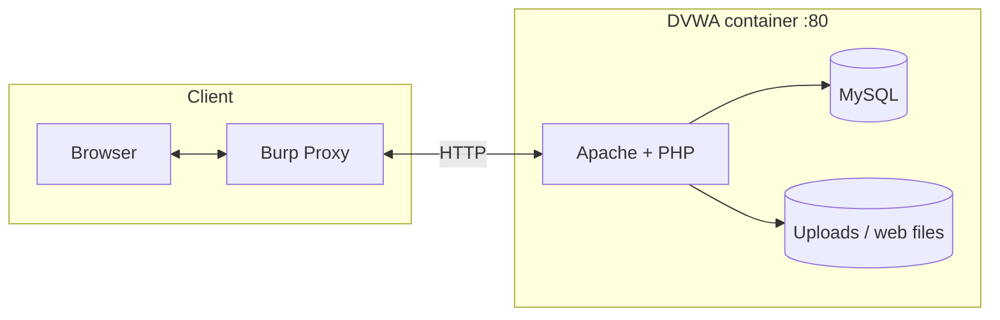
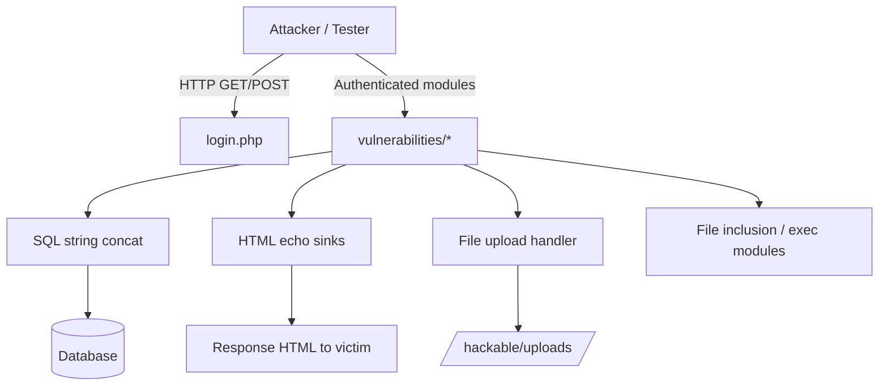

# Attack surface — entry points and data flow

Text + Mermaid views of how traffic reaches vulnerable sinks in the DVWA lab.

## High-level flow

## Request paths (logical)

## Entry → typical weakness (quick reference)

| You touch… | Data often flows to… | Classic mistake |
|------------|----------------------|-----------------|
| Query params (`id`, `name`, …) | SQL or HTML templates | Concatenation / no encoding |
| Forms (login, guestbook) | Auth logic / DB writes | No rate limit / stored HTML |
| Upload UI | Filesystem + URL | Predictable names, weak ACL |
| “View file” style params | Disk or remote fetch | Path traversal, SSRF (in other apps) |

Use this diagram in interviews to explain **where** you look first after mapping routes in Burp’s site map.
